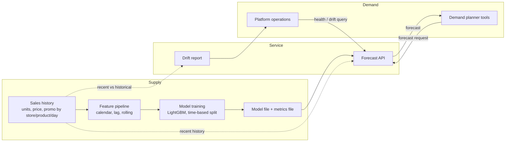

# 5. Information Flows and Interfaces

Describes what information moves between which parties, in what form, how often,
and what must be true of it. "Supply" is the data and models the service
depends on; "demand" is what consumers ask of it.

## Data-flow diagram

## Interface catalogue

| ID | From | To | Information | Format | Frequency | Quality rules |
|----|------|----|-------------|--------|-----------|---------------|
| IF-01 | Sales source (here: a data generator; in practice: point-of-sale / ERP) | Feature pipeline | Daily units, price and promo flag per store/product | CSV with `date, store_id, item_id, price, promo, units_sold` | Daily (assumed) | One row per store/product/day; units non-negative; no missing dates |
| IF-02 | Feature pipeline | Model training | Feature table with calendar, lag (1, 7, 14, 28 days) and rolling (7, 28 days) features | In-memory table | On retrain | No feature may use the row's own or future data; warm-up rows dropped |
| IF-03 | Model training | Forecast API | Model file and metrics file | Binary model; JSON metrics | On retrain | Metrics must include the baseline comparison |
| IF-04 | Demand planner tools | Forecast API | Forecast request: store, product, date, price, promo | JSON over HTTP | On demand | Store 1-5, product 1-10, price > 0; invalid input rejected |
| IF-05 | Forecast API | Demand planner tools | Forecast: units, with echo of store, product, date | JSON over HTTP | On demand | Non-negative; rounded to two decimals |
| IF-06 | Forecast API | Platform operations | Health status; drift report by feature with PSI and status | JSON over HTTP | On demand | PSI below 0.1 stable, 0.1-0.25 moderate, above 0.25 significant |
| IF-07 | Forecast API | Log store | Request ID, method, path, status, duration | Log lines | Every request | Request ID unique per request |

## Dependencies between flows

- IF-04/IF-05 depend on IF-03: no model file means the API refuses to forecast (service-unavailable error).
- IF-06 (drift) depends on IF-01 history being kept current; stale history makes the drift report meaningless.
- IF-02 is the single place where leakage can enter, which is why it carries its own tests.

## Open questions for stakeholders

1. Who owns IF-01 in a real deployment, and what is the latency between a sale and its appearance in the history?
2. Should forecasts be returned to the planning tool in bulk (all stores, all products) as well as one at a time?
3. Who is notified when drift is "significant", and what is the agreed response?
