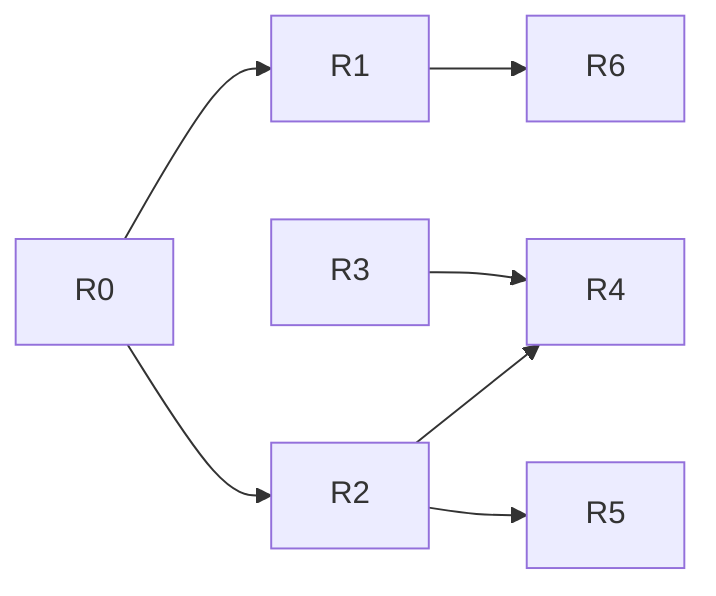

# 6. Product Roadmap

Status is stated plainly: **Delivered** means built and tested in the forecasting
repo; **Planned** means not built.

## Delivered (v1.0)

| Item | Outcome | Evidence |
|------|---------|----------|
| Forecast API (FR-01 to FR-03) | Planners can request a forecast and are protected from bad input | Tests in `tests/test_api.py` |
| Accuracy reporting against baseline (FR-04, FR-07) | The model is shown to beat last week's number | `models/metrics.json` |
| Drift monitoring (FR-05) | Operators can see when data has shifted | `tests/test_monitoring.py` |
| Leakage-safe features (FR-06) | Reported accuracy is honest | `tests/test_features.py` |
| Automated build, test, package (NFR-01, NFR-02) | Releases are repeatable | CI workflow |

## Next and later

| ID | Item | Priority | Depends on | Acceptance criteria | Intended outcome | Status |
|----|------|----------|------------|--------------------|------------------|--------|
| R0 | Close traceability gaps 1-3 (baseline assertion, logging test, agreed latency target) | Must | Stakeholder decision on latency target | Each gap has a test; matrix shows no gaps | Every requirement provably met | Planned |
| R1 | Scheduled retraining with an alert when drift is "significant" | Should | R0; IF-06 drift report | Given significant drift, when the schedule runs, then the model is retrained and the change in error is recorded and reported | Forecast stays reliable without manual checking | Planned |
| R2 | Real data feed with data-quality checks (missing days, negative units, duplicate rows) | Must | Sign-off of interface IF-01 owner and format | Given a feed with a missing day, when it is loaded, then the load is flagged and not silently accepted | Accuracy claims rest on real data, not synthetic | Planned |
| R3 | Authentication and per-user access | Should | A deployment target | Given an unauthenticated request, when it reaches the API, then it is refused | Service safe to expose beyond one team | Planned |
| R4 | Cloud deployment of the container with a managed SQL store for history | Could | R2, R3 | Given a push to the main branch, when the pipeline completes, then the new version is running in the cloud environment | Always-on service that does not depend on one machine | Planned |
| R5 | Multi-day forecast horizon | Could | R2 | Given a request for 7 days ahead, when answered, then each day carries a forecast and the error is reported by horizon | Planners can plan a week, not a day | Planned |
| R6 | Accuracy and drift dashboard in Power BI | Could | R1 | Given the latest run, when opened, then error by store and drift status are visible | Non-technical stakeholders can see service health | Planned |

## Sequencing rationale

1. **R0 first:** it is cheap and removes doubt about what is already claimed.
2. **R2 before R1/R4/R5:** everything later is only as good as the data under it, and the largest standing caveat (constraint C1) is that no real data has been used.
3. **R3 before R4:** do not put an unauthenticated service on a public cloud.
4. **R6 last:** presentation of results, valuable only once R1 produces something worth showing.

## Dependency view

